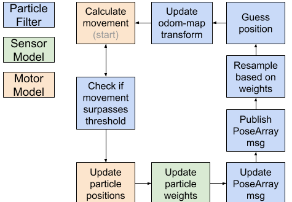
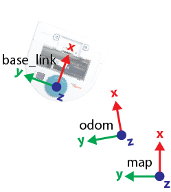
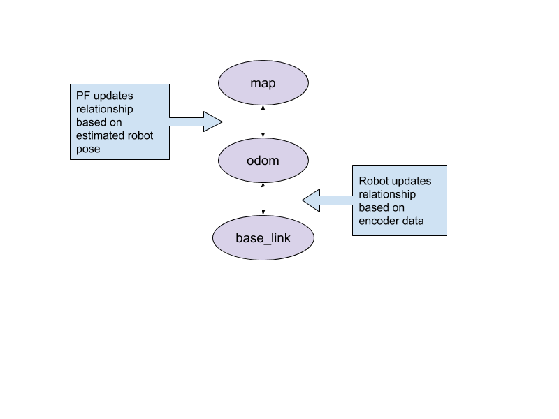
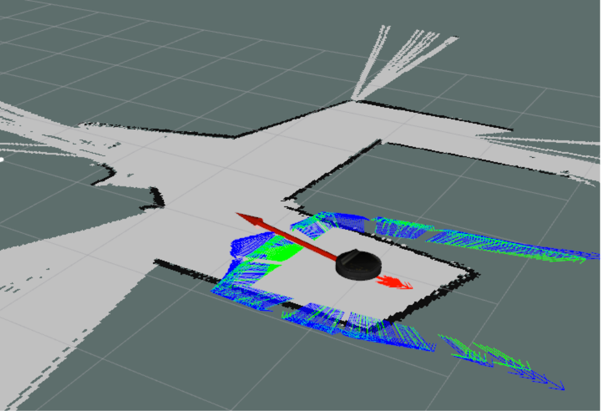
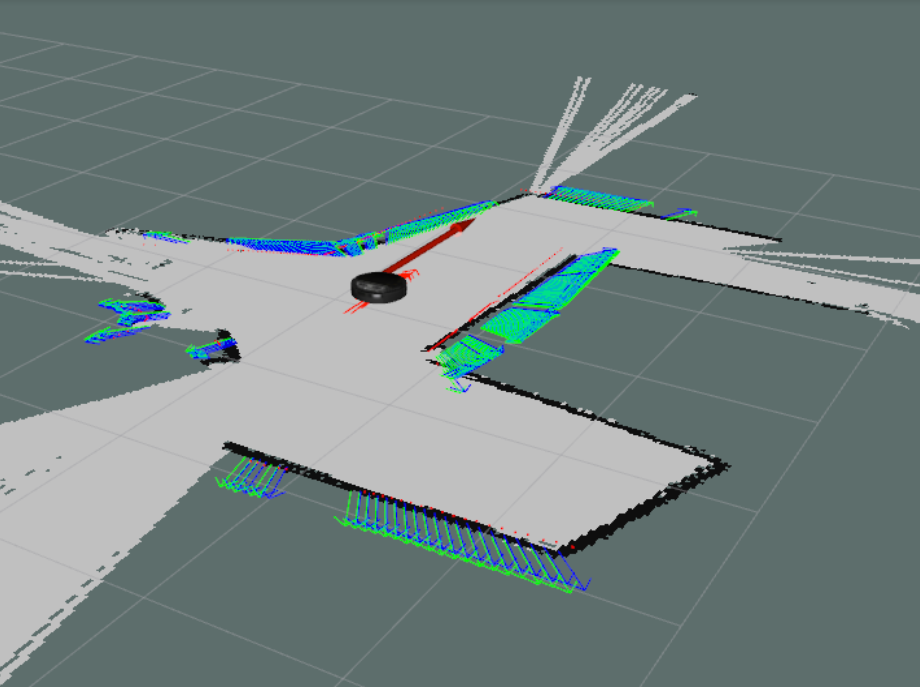

# Overview

Robot localization is a fundamental challenge of robotics; fast and accurate localization allows robots to operate dynamically in complex environments. The goal of this project was to learn about the particle filter, an algorithm designed to localize a robot in an environment given a pre-built map. The filter was implemented in Python using ROS on a Neato - a simple differential-drive robotic platform with a single 360o lidar. The maps were built using ROS’s built-in map generation library, gmapping. For more information on the assignment, see the `robot_localization_assignment.html` file in the repository’s main branch [(link)](https://github.com/mary-keenan/robot_localization/blob/master/robot_localization_assignment.html). 

The particle filter takes in a map of a given area and the robot’s odometry and lidar outputs. It then outputs a continually improving guess at the robot’s position and orientation. The filter itself is initialized with a randomly distributed set of particles which represent possible positions and orientations of the robot in the map and a guess at the robot’s initial position. It then performs the following steps in a loop:
1. Get the robot’s motion since the last filter update
2. Transform each particle in the map frame based on the robot’s motion, adding noise to account for odometry imperfections
3. Use the robot’s current sensor data to weight the particles (see Design Decisions)
4. Resample particles based on weights (See Weighting and Downsampling)
5. Take the average of the particles as a best guess at the robot’s pose

This repository contains two particle filter implementations, each housed in a separate branch. Both approaches use a similar structure (see Architecture), but have variations in implementation.

## Running Code
To test the filter, first clone the repository and download any prerequisite packages to successfully run `catkin_make`. Then follow the instructions for the desired branch below.

### Branch `pfilter_novak`
1. In a new terminal, run `$ roslaunch robot_localizer test_bagfile.launch map_name:=ac_109_1 use_builtin:=false`
2. With the initial terminal selected, press the spacebar to start the rosbag.
3. Wait until the second terminal (running the particle filter) logs a message stating that it is “Initializing sensor model”.
4. Use the “2D Pose Estimate” tool in Rviz to provide the particle filter with an initial estimate of the robot’s position in the map.
5. The robot should attempt to localize itself in the map.

### Branch `mary_pf`
1. In a new terminal, run `roscore`
2. In a new terminal, run `roslaunch robot_localizer test_bagfile.launch map_name:=ac109_1 use_builtin:=false`
3. Make a 2D Pose estimate in rviz -- you should see a red arrow marking the spot you picked. 
  - *If you don’t see the arrow, try making the 2D Pose estimate again; the program takes a few seconds to start and may have missed your estimate.*
  
# Architecture

The fundamental structure of the two implementations is the same. The code is organized in four classes:  

**ParticleFilter - SensorModel - MotorModel - WeightedPose**  

WeightedPose is the structure for representing particles. In `pfilter_novak`, WeightedPose is a ROSmsg type consisting of a float weight and a StampedPose. In `mary_pf,`, WeightedPose is a simple object with two attributes, pose and weight, that is used to keep track of poses’ weights. The SensorModel and MotorModel run independently of the ParticleFilter as separate nodes; the ParticleFilter uses their various methods to read and filter data from the robot. Figure 1 represents a single iteration of a particle filter update.

  
**Figure 1:** Flowchart depicting steps involved in a single particle filter run loop instance

The loop first checks how much the robot has moved since it last updated. If the robot has moved beyond a certain threshold, it proceeds to update the particle filter. Once the filter has confirmed that there has been significant movement, it uses the calculated movement values (x, y, θ) to update particle positions via a helper function in the MotorModel, which adds in noise values drawn randomly from a gaussian distribution and proportional to the magnitude of the movement. The particle weights are then calculated in the SensorModel using sensor data and the updated particle positions. The run loop concludes by resampling and averaging the particles to make a guess at the robot’s pose, then updating the relationship between the robot and the map based on that guess. 
 
 
**Figure 2:** Diagram depicting the base_link, odom, and map coordinate frames, along with their spatial relationships  

The filter uses three coordinate frames: map, odom, and base_link. As shown in Figure 2, the robot’s location data in the odom frame after it has been transformed from base_link. The ParticleFilter then uses its guess for the robot's pose within the map frame to update the transform from map to odom, as shown in Figure 3.

  
**Figure 3:** Tf frame diagram depicting the relationship between the base_link, odom, and map coordinate frames and how each transform is updated.

# Design Decisions
This section sheds further light on some design decisions that were made during the implementation of the particle filter. Each branch's solution to the problem is described in detail, as the two implementations do not necessarily use the same solution to each problem.

## Particle Filter Update Rate
Because the particle filter is transforming and accessing a large number of particles each iteration, it can run quite slowly. This speed is an issue, given that the robot continues to move while the filter is processing. The two filter implementations call the main filter loop in different ways. 

### Branch `pfilter_novak`
In this branch, the motor_model node only publishes a message every time the robot’s linear or rotational motion crosses either of the saved thresholds. The particle filter runs once for each message receipt. The advantage of this approach is that the particle filter does not miss any update messages and doesn’t get any message more than once, which can result in overfitting to sensor data. However, because the loop runs for every message received, if the update rates of the motor model and particle filter are mismatched, the particle filter lags behind.

### Branch `mary_pf`
In this branch, the motor_model node doesn’t publish motion messages; the particle filter class itself is constantly updating the robot’s current position in a separate callback method. The particle filter only runs when the distance between the robot’s position the last time the filter ran is significantly different than the robot’s current position -- in other words, it only runs if the robot has moved more than some threshold. This means that the particle filter is always using the most recent position data, so this approach doesn’t lag behind the robot. If the current position updates before the loop is finished running, the particle filter will not be affected by that message and will simply use whichever message is most recent for its next iteration. The con of this approach is that it added to the clunkiness of the particle filter class by delegating some of the functionality that should be in motor_model. 

## Weighting and Downsampling
    
Across both branches, particle weights are better described as particle errors; having a higher “weight” implies that the particle fits the sensor data more poorly. During the downsampling step, the weighted poses are sorted by their weights and some tuneable number of particles with the lowest weights are kept. The weights of the remaining particles are recalculated in terms of percentage -- a given particle’s weight over the sum of all of the remaining particles’ weights -- and how many points are cloned around them is proportional to how low their error is compared to other kept points. The continued use of the somewhat misleading word “weight” is intended to make the code more congruent to other approaches to this problem; people familiar with particle filters will understand that the errors play the role of the particle weights, albeit a flipped version. Keeping the weights in terms of errors requires less processing and less code.

# Challenges
Throughout the project's duration, the team ran into a number of challenges which are explained in further detail here. This section is intended to provide direction and suggestions for future projects, both in the robot odometry space and in the more general space of writing code for robotic systems.

## Visualization
The chosen implementation of the particle filter has a number of steps that are complicatedto implement, making it easy to introduce errors. To verify the different steps of the filter, both implementations of the filter use rviz to visualize the relationship between the coordinate frames, as well as the input and output data from numerous steps internal to the filter. This visualization frequently pointed out subtle bugs in the implementation of the algorithm that were not clear from raw data printouts. However, by the end of the project, these visualizations provided a clear understanding of each of the steps of the algorithm. 

Figures 4 and 5 show the visualizations used to make sure the weighting was working correctly for `pf_mary`. The green arrows are the locations of the “obstacles” you would expect to see given the sensor data and this particular particle’s pose. The blue arrows represent the distance between that green arrow and the closest obstacle. For example, if the green arrows are located against a wall as they are in 5, the blue arrows will be right on top of them, but if the green arrows are in open space, as in 4, the blue arrows will be ahead of them. The distance from the blue to the green arrows represents how far the green arrow is from the closest obstacle. This visualization made clear the fact that null sensor data (value of 0.0) was not being filtered out correctly, which was heavily influencing the weighting.

  
**Figure 4:** Screenshot of rviz showing output visualization of sensor data and respective weights for a bad pose.

  
**Figure 5:** Screenshot of rviz showing output visualization of sensor data and respective weights for a good pose.

## Debugging

The quantity of data and particle filter processing speed was the primary headache when it came to debugging. Print statement output sometimes flashed by at a few hundred rows per second, and even if the bag file was paused, working through all of the data or calculated errors was time-consuming. In hindsight, debugging a single particle with only four sensor readings would have been more efficient than debugging a weighting problem with five particles, each with 360 sensor readings.

# Future Work

While designing the particle filters, some thought was given to theoretical bottlenecks and some design decisions were made to mitigate the impact of this timing. However, no benchmarking of specific operations was done to determine which steps of the algorithm offered the largest possible time savings. Future work could analyze each step of the algorithm, as well as the data structures used to store and transform particles, to determine where to make changes and improve performance. Speed improvement is important for operational implementations of the particle on real robots, where the stakes are higher and there is less lag tolerance.

Another area where the particle filter could gain large improvements is parameter optimization. Many filter coefficients were chosen based on intuition. These included the number of particles, the percentage of particles retained across loops, and the magnitudes of noise injected into the motor model. Future work could perform rough optimization on these parameters for a selection of environments to determine how each parameter affects the resulting particle filter. Some metrics for evaluation could be time to convergence, accuracy over time, and robustness to noise.

# Lessons Learned
    
There were two big takeaways from this project. First, regularly reassess your code structure as you work, and second, come up with a modular testing plan before starting implementataion. While writing the architecture portion of this report, it became clear that there were weak points in the code’s design; for example, in `mary_pf`, the motor_model was originally publishing a slightly processed version of odom for the particle_filter to listen to, which was redundant -- the particle_filter could just listen to odom and do the same conversion in its callback. This publisher/subscriber relationship was a leftover structure from an earlier version of the code that better utilized it, and it was removed in the final version. Reassessing the code architecture more frequently will help its overall structure and readability. 

The second lesson (coming up with modular testing plans) is the result of a particularly poignant pain point. The code in `mary_pf` underwent minimal testing in its development, and as a result, the majority of the time spent working on `mary_pf` went to disorganized debugging. Designing tests for specific stopping points ahead of time would have made the project less frustrating. The code in `pfilter_novak` was constructed in a slightly more organized manner, with visualizations built in along the way. However, a pre-plan for testing various stages of the algorithm would still have allowed the project to make much more significant progress.
